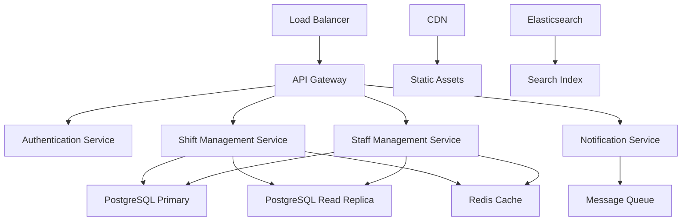

# ⚡ ShiftMaster - パフォーマンス最適化ガイド

## 📊 パフォーマンス概要

ShiftMaster医療シフト管理システムは、24時間365日稼働する医療機関での使用を想定し、高いパフォーマンスと可用性を提供するよう設計されています。

## 🎯 パフォーマンス目標

### SLA (Service Level Agreement)

| メトリクス | 目標値 | 許容値 | 測定方法 |
|-----------|--------|--------|----------|
| **レスポンス時間** | < 200ms | < 500ms | P95 |
| **可用性** | 99.9% | 99.5% | 月次 |
| **スループット** | 1000 req/sec | 500 req/sec | ピーク時 |
| **データベース応答** | < 50ms | < 100ms | 平均 |
| **ページロード時間** | < 2秒 | < 3秒 | First Contentful Paint |
| **API応答時間** | < 100ms | < 300ms | P99 |

### 医療システム特有要件

```yaml
medical_performance_requirements:
  emergency_response:
    target: "< 50ms"
    description: "緊急時アラート・通知"
    
  shift_lookup:
    target: "< 100ms" 
    description: "当日シフト検索"
    
  staff_availability:
    target: "< 200ms"
    description: "スタッフ空き状況確認"
    
  schedule_generation:
    target: "< 5秒"
    description: "月次スケジュール自動生成"
    
  compliance_reporting:
    target: "< 10秒"
    description: "規制レポート生成"
```

## 🏗️ アーキテクチャ最適化

### マイクロサービス分散アーキテクチャ



### 水平スケーリング戦略

```python
# 自動スケーリング設定
AUTO_SCALING_CONFIG = {
    "web_servers": {
        "min_instances": 2,
        "max_instances": 10,
        "target_cpu_utilization": 70,
        "scale_up_threshold": 80,
        "scale_down_threshold": 30,
        "cooldown_period": 300  # 秒
    },
    "database": {
        "read_replicas": {
            "min": 1,
            "max": 3,
            "auto_scale_by_connections": True
        },
        "connection_pooling": {
            "max_connections": 200,
            "min_connections": 20
        }
    },
    "cache": {
        "redis_cluster": {
            "nodes": 3,
            "memory_per_node": "4GB",
            "eviction_policy": "allkeys-lru"
        }
    }
}

class AutoScaler:
    """自動スケーリング管理"""
    
    def monitor_and_scale(self):
        """リアルタイム監視・スケーリング"""
        metrics = self.get_current_metrics()
        
        # CPU使用率チェック
        if metrics["cpu_usage"] > 80:
            self.scale_up_web_servers()
        elif metrics["cpu_usage"] < 30:
            self.scale_down_web_servers()
        
        # データベース接続数チェック
        if metrics["db_connections"] > 150:
            self.add_read_replica()
        
        # メモリ使用率チェック
        if metrics["memory_usage"] > 85:
            self.increase_cache_memory()
```

## 💾 データベース最適化

### クエリ最適化

```python
# 効率的なクエリパターン
class OptimizedShiftQueries:
    """最適化されたシフトクエリ"""
    
    @staticmethod
    def get_weekly_schedule(start_date, department_id):
        """週間スケジュール取得（最適化版）"""
        return Shift.objects.select_related(
            'staff__user',
            'department'
        ).prefetch_related(
            'staff__qualifications'
        ).filter(
            date__range=(start_date, start_date + timedelta(days=7)),
            department_id=department_id
        ).order_by('date', 'start_time')
    
    @staticmethod
    def get_staff_availability(date, department_id):
        """スタッフ空き状況（最適化版）"""
        # サブクエリでシフト中スタッフを除外
        busy_staff = Shift.objects.filter(
            date=date
        ).values_list('staff_id', flat=True)
        
        return Staff.objects.select_related(
            'user', 'department'
        ).filter(
            department_id=department_id,
            is_active=True
        ).exclude(
            id__in=busy_staff
        ).annotate(
            qualification_count=Count('qualifications')
        ).order_by('-qualification_count')
    
    @staticmethod
    def get_department_coverage(date_range):
        """部署カバレッジ分析（最適化版）"""
        return Shift.objects.values(
            'department__name',
            'date'
        ).annotate(
            total_hours=Sum(
                Extract('hour', F('end_time') - F('start_time'))
            ),
            staff_count=Count('staff', distinct=True)
        ).filter(
            date__range=date_range
        ).order_by('department__name', 'date')
```

### インデックス戦略

```sql
-- パフォーマンス重要インデックス
CREATE INDEX CONCURRENTLY idx_shifts_date_department 
ON shifts_shift (date, department_id);

CREATE INDEX CONCURRENTLY idx_shifts_staff_date 
ON shifts_shift (staff_id, date);

CREATE INDEX CONCURRENTLY idx_shifts_datetime_range 
ON shifts_shift (date, start_time, end_time);

-- 複合インデックス（検索頻度高）
CREATE INDEX CONCURRENTLY idx_staff_department_active 
ON shifts_staff (department_id, is_active) 
WHERE is_active = true;

-- 部分インデックス（アクティブスタッフのみ）
CREATE INDEX CONCURRENTLY idx_staff_active_role 
ON shifts_staff (role, created_at) 
WHERE is_active = true;

-- JSONフィールド用インデックス
CREATE INDEX CONCURRENTLY idx_staff_qualifications_gin 
ON shifts_staff USING gin (qualifications);

-- 全文検索用インデックス
CREATE INDEX CONCURRENTLY idx_staff_search_vector 
ON shifts_staff USING gin (search_vector);
```

### 接続プール最適化

```python
# データベース接続プール設定
DATABASES = {
    'default': {
        'ENGINE': 'django.db.backends.postgresql',
        'NAME': 'shiftmaster',
        'USER': 'shiftmaster_user',
        'PASSWORD': os.environ['DB_PASSWORD'],
        'HOST': 'db-primary',
        'PORT': '5432',
        'OPTIONS': {
            # 接続プール設定
            'MAX_CONNS': 200,
            'MIN_CONNS': 20,
            
            # 接続タイムアウト
            'CONN_MAX_AGE': 300,
            'CONN_HEALTH_CHECKS': True,
            
            # パフォーマンス設定
            'autocommit': True,
            'isolation_level': psycopg2.extensions.ISOLATION_LEVEL_READ_COMMITTED,
            
            # バッファ設定
            'shared_preload_libraries': 'pg_stat_statements',
            'effective_cache_size': '4GB',
            'work_mem': '16MB',
        }
    },
    'read_replica': {
        'ENGINE': 'django.db.backends.postgresql',
        'NAME': 'shiftmaster',
        'USER': 'shiftmaster_readonly',
        'PASSWORD': os.environ['DB_READONLY_PASSWORD'],
        'HOST': 'db-replica',
        'PORT': '5432',
        'OPTIONS': {
            'MAX_CONNS': 100,
            'MIN_CONNS': 10,
        }
    }
}

# 読み取り専用クエリのルーティング
class DatabaseRouter:
    """データベースルーティング"""
    
    read_only_models = [
        'reports', 'analytics', 'logs'
    ]
    
    def db_for_read(self, model, **hints):
        """読み取りクエリのルーティング"""
        if model._meta.app_label in self.read_only_models:
            return 'read_replica'
        
        # 重いクエリはリードレプリカへ
        if hints.get('heavy_query'):
            return 'read_replica'
        
        return 'default'
    
    def db_for_write(self, model, **hints):
        """書き込みクエリは常にプライマリ"""
        return 'default'
```

## 🚀 キャッシング戦略

### 多層キャッシュアーキテクチャ

```python
# キャッシュ設定
CACHES = {
    'default': {
        'BACKEND': 'django_redis.cache.RedisCache',
        'LOCATION': 'redis://redis-cluster:6379/0',
        'OPTIONS': {
            'CLIENT_CLASS': 'django_redis.client.DefaultClient',
            'CONNECTION_POOL_KWARGS': {
                'max_connections': 50,
                'health_check_interval': 30,
            },
            'COMPRESSOR': 'django_redis.compressors.zlib.ZlibCompressor',
            'SERIALIZER': 'django_redis.serializers.msgpack.MSGPackSerializer',
        },
        'TIMEOUT': 300,
        'KEY_PREFIX': 'shiftmaster',
        'VERSION': 1,
    },
    'session': {
        'BACKEND': 'django_redis.cache.RedisCache',
        'LOCATION': 'redis://redis-cluster:6379/1',
        'TIMEOUT': 3600,
    },
    'long_term': {
        'BACKEND': 'django_redis.cache.RedisCache',
        'LOCATION': 'redis://redis-cluster:6379/2',
        'TIMEOUT': 86400,  # 24時間
    }
}

class SmartCacheManager:
    """インテリジェントキャッシュ管理"""
    
    def __init__(self):
        self.cache = cache
        self.long_cache = caches['long_term']
    
    def get_or_set_with_tags(self, key, factory_func, timeout=300, tags=None):
        """タグ付きキャッシュ"""
        data = self.cache.get(key)
        if data is None:
            data = factory_func()
            self.cache.set(key, data, timeout)
            
            # タグ管理
            if tags:
                for tag in tags:
                    self.add_to_tag_set(tag, key)
        
        return data
    
    def invalidate_by_tag(self, tag):
        """タグによる一括無効化"""
        keys = self.get_keys_by_tag(tag)
        self.cache.delete_many(keys)
        self.clear_tag_set(tag)
    
    def warm_cache(self):
        """キャッシュウォームアップ"""
        # よく使用されるデータを事前キャッシュ
        self.warm_department_data()
        self.warm_staff_data()
        self.warm_current_week_shifts()
    
    def warm_department_data(self):
        """部署データキャッシュ"""
        departments = Department.objects.select_related().all()
        for dept in departments:
            cache_key = f"department:{dept.id}"
            self.long_cache.set(cache_key, dept, 86400)
    
    def warm_current_week_shifts(self):
        """今週のシフトキャッシュ"""
        today = timezone.now().date()
        week_start = today - timedelta(days=today.weekday())
        
        shifts = Shift.objects.select_related(
            'staff__user', 'department'
        ).filter(
            date__range=(week_start, week_start + timedelta(days=7))
        )
        
        cache_key = f"current_week_shifts:{week_start}"
        self.cache.set(cache_key, list(shifts), 3600)
```

### アプリケーションレベルキャッシュ

```python
# ビューレベルキャッシュ
from django.views.decorators.cache import cache_page
from django.utils.decorators import method_decorator

@method_decorator(cache_page(300), name='get')  # 5分キャッシュ
class ShiftListView(ListView):
    """シフト一覧ビュー（キャッシュ付き）"""
    model = Shift
    
    def get_cache_key(self):
        """動的キャッシュキー生成"""
        params = self.request.GET
        user_dept = self.request.user.department_id
        return f"shift_list:{user_dept}:{hash(frozenset(params.items()))}"

# テンプレートフラグメントキャッシュ
@register.inclusion_tag('shifts/shift_card.html')
def shift_card(shift):
    """シフトカードテンプレート（フラグメントキャッシュ）"""
    cache_key = f"shift_card:{shift.id}:{shift.updated_at.timestamp()}"
    return cache.get_or_set(cache_key, lambda: {
        'shift': shift,
        'staff_name': shift.staff.get_full_name(),
        'department': shift.department.name,
    }, 3600)

# APIレスポンスキャッシュ
class CachedAPIView(APIView):
    """キャッシュ付きAPIビュー"""
    cache_timeout = 300
    
    def get(self, request, *args, **kwargs):
        cache_key = self.get_cache_key(request, *args, **kwargs)
        
        response_data = cache.get(cache_key)
        if response_data is None:
            response_data = self.get_response_data(request, *args, **kwargs)
            cache.set(cache_key, response_data, self.cache_timeout)
        
        return Response(response_data)
    
    def get_cache_key(self, request, *args, **kwargs):
        """リクエスト固有のキャッシュキー"""
        url_params = request.query_params.dict()
        user_id = request.user.id
        return f"api:{self.__class__.__name__}:{user_id}:{hash(frozenset(url_params.items()))}"
```

## 🎨 フロントエンド最適化

### アセット最適化

```javascript
// Webpack設定（本番環境）
const path = require('path');
const MiniCssExtractPlugin = require('mini-css-extract-plugin');
const TerserPlugin = require('terser-webpack-plugin');
const CompressionPlugin = require('compression-webpack-plugin');

module.exports = {
  mode: 'production',
  
  optimization: {
    minimizer: [
      new TerserPlugin({
        parallel: true,
        terserOptions: {
          compress: {
            drop_console: true,
            drop_debugger: true,
          },
        },
      }),
    ],
    
    splitChunks: {
      chunks: 'all',
      cacheGroups: {
        vendor: {
          test: /[\\/]node_modules[\\/]/,
          name: 'vendors',
          priority: 10,
        },
        common: {
          name: 'common',
          minChunks: 2,
          priority: 5,
        },
      },
    },
  },
  
  plugins: [
    new MiniCssExtractPlugin({
      filename: '[name].[contenthash].css',
      chunkFilename: '[id].[contenthash].css',
    }),
    
    new CompressionPlugin({
      algorithm: 'gzip',
      test: /\.(js|css|html|svg)$/,
      threshold: 8192,
      minRatio: 0.8,
    }),
  ],
  
  module: {
    rules: [
      {
        test: /\.js$/,
        exclude: /node_modules/,
        use: {
          loader: 'babel-loader',
          options: {
            presets: ['@babel/preset-env'],
            plugins: ['@babel/plugin-syntax-dynamic-import'],
          },
        },
      },
      
      {
        test: /\.(png|jpg|gif|svg)$/,
        use: [
          {
            loader: 'url-loader',
            options: {
              limit: 8192,
              name: '[name].[hash].[ext]',
              outputPath: 'images/',
            },
          },
          {
            loader: 'image-webpack-loader',
            options: {
              mozjpeg: { progressive: true, quality: 85 },
              optipng: { enabled: true },
              pngquant: { quality: [0.65, 0.90], speed: 4 },
              gifsicle: { interlaced: false },
            },
          },
        ],
      },
    ],
  },
};
```

### レイジーローディング

```javascript
// コンポーネントレイジーローディング
class ShiftCalendar {
    constructor() {
        this.loadCalendarModule();
    }
    
    async loadCalendarModule() {
        // 大きなカレンダーライブラリを遅延読み込み
        const { Calendar } = await import('./modules/calendar');
        this.calendar = new Calendar();
        this.initializeCalendar();
    }
    
    async loadShiftData(date) {
        // シフトデータの段階的読み込み
        const visibleRange = this.getVisibleDateRange();
        const shifts = await this.fetchShifts(visibleRange);
        this.renderShifts(shifts);
    }
    
    // Intersection Observer for lazy loading
    setupLazyLoading() {
        const observer = new IntersectionObserver((entries) => {
            entries.forEach(entry => {
                if (entry.isIntersecting) {
                    this.loadShiftDetails(entry.target);
                    observer.unobserve(entry.target);
                }
            });
        });
        
        document.querySelectorAll('.shift-card').forEach(card => {
            observer.observe(card);
        });
    }
}

// 画像遅延読み込み
class LazyImageLoader {
    static init() {
        if ('IntersectionObserver' in window) {
            const imageObserver = new IntersectionObserver((entries) => {
                entries.forEach(entry => {
                    if (entry.isIntersecting) {
                        const img = entry.target;
                        img.src = img.dataset.src;
                        img.classList.remove('lazy');
                        imageObserver.unobserve(img);
                    }
                });
            });
            
            document.querySelectorAll('img[data-src]').forEach(img => {
                imageObserver.observe(img);
            });
        }
    }
}
```

### Critical CSS インライン化

```python
# Critical CSS 抽出・インライン化
def generate_critical_css(url):
    """クリティカルCSS生成"""
    import subprocess
    
    # Puppeteerを使用してクリティカルCSS抽出
    result = subprocess.run([
        'node', 'extract-critical-css.js',
        '--url', url,
        '--width', '1300',
        '--height', '900'
    ], capture_output=True, text=True)
    
    return result.stdout

# テンプレートでクリティカルCSS使用
class OptimizedTemplateView(TemplateView):
    """最適化されたテンプレートビュー"""
    
    def get_context_data(self, **kwargs):
        context = super().get_context_data(**kwargs)
        
        # クリティカルCSSをインライン化
        if not settings.DEBUG:
            critical_css = cache.get_or_set(
                f'critical_css:{self.template_name}',
                lambda: self.get_critical_css(),
                86400  # 24時間キャッシュ
            )
            context['critical_css'] = critical_css
        
        return context
    
    def get_critical_css(self):
        """クリティカルCSS取得"""
        current_url = self.request.build_absolute_uri()
        return generate_critical_css(current_url)
```

## 📱 モバイル最適化

### PWA対応

```javascript
// Service Worker for PWA
self.addEventListener('install', event => {
    event.waitUntil(
        caches.open('shiftmaster-v1').then(cache => {
            return cache.addAll([
                '/',
                '/static/css/app.css',
                '/static/js/app.js',
                '/shifts/',
                '/offline.html'
            ]);
        })
    );
});

self.addEventListener('fetch', event => {
    // ネットワーク優先、キャッシュフォールバック
    event.respondWith(
        fetch(event.request)
            .then(response => {
                // 成功時はキャッシュを更新
                if (response.status === 200) {
                    const responseClone = response.clone();
                    caches.open('shiftmaster-v1').then(cache => {
                        cache.put(event.request, responseClone);
                    });
                }
                return response;
            })
            .catch(() => {
                // ネットワークエラー時はキャッシュから提供
                return caches.match(event.request)
                    .then(response => {
                        return response || caches.match('/offline.html');
                    });
            })
    );
});

// プッシュ通知
self.addEventListener('push', event => {
    const options = {
        body: event.data.text(),
        icon: '/static/icons/notification-icon.png',
        badge: '/static/icons/badge.png',
        vibrate: [100, 50, 100],
        data: {
            url: '/shifts/'
        },
        actions: [
            {
                action: 'view',
                title: 'シフト確認'
            },
            {
                action: 'close',
                title: '閉じる'
            }
        ]
    };
    
    event.waitUntil(
        self.registration.showNotification('ShiftMaster', options)
    );
});
```

### レスポンシブ画像

```html
<!-- レスポンシブ画像配信 -->
<picture>
    <source 
        media="(max-width: 768px)" 
        srcset="/static/images/staff-photo-small.webp 1x, 
                /static/images/staff-photo-small@2x.webp 2x"
        type="image/webp">
    <source 
        media="(max-width: 768px)" 
        srcset="/static/images/staff-photo-small.jpg 1x, 
                /static/images/staff-photo-small@2x.jpg 2x">
    <source 
        srcset="/static/images/staff-photo.webp 1x, 
                /static/images/staff-photo@2x.webp 2x"
        type="image/webp">
    
</picture>
```

## 📊 パフォーマンス監視

### リアルタイムモニタリング

```python
# カスタムミドルウェアでパフォーマンス測定
class PerformanceMonitoringMiddleware:
    """パフォーマンス監視ミドルウェア"""
    
    def __init__(self, get_response):
        self.get_response = get_response
    
    def __call__(self, request):
        start_time = time.time()
        
        # データベースクエリ数をトラッキング
        initial_queries = len(connection.queries)
        
        response = self.get_response(request)
        
        # パフォーマンスメトリクス計算
        response_time = time.time() - start_time
        query_count = len(connection.queries) - initial_queries
        
        # メトリクス記録
        self.record_metrics(request, response, response_time, query_count)
        
        # レスポンスヘッダーに追加
        response['X-Response-Time'] = f"{response_time:.3f}s"
        response['X-Query-Count'] = str(query_count)
        
        return response
    
    def record_metrics(self, request, response, response_time, query_count):
        """メトリクス記録"""
        # Prometheusメトリクス
        REQUEST_DURATION.labels(
            method=request.method,
            endpoint=request.path,
            status=response.status_code
        ).observe(response_time)
        
        QUERY_COUNT.labels(
            endpoint=request.path
        ).observe(query_count)
        
        # 閾値チェック
        if response_time > 1.0:  # 1秒以上
            logger.warning(
                f"Slow request: {request.path} took {response_time:.3f}s "
                f"with {query_count} queries"
            )
        
        if query_count > 10:  # 10クエリ以上
            logger.warning(
                f"High query count: {request.path} executed {query_count} queries"
            )
```

### APMツール統合

```python
# New Relic / DataDog 統合
import newrelic.agent

@newrelic.agent.function_trace()
def generate_monthly_schedule(department_id, year, month):
    """月次スケジュール生成（トレース付き）"""
    with newrelic.agent.BackgroundTask(application, 'schedule_generation'):
        # 複雑なスケジュール生成ロジック
        pass

# カスタムメトリクス
def record_business_metrics():
    """ビジネスメトリクス記録"""
    # アクティブユーザー数
    active_users = User.objects.filter(
        last_login__gte=timezone.now() - timedelta(hours=24)
    ).count()
    newrelic.agent.record_custom_metric('Custom/ActiveUsers', active_users)
    
    # 今日のシフト数
    todays_shifts = Shift.objects.filter(date=timezone.now().date()).count()
    newrelic.agent.record_custom_metric('Custom/TodaysShifts', todays_shifts)
    
    # データベースサイズ
    db_size = get_database_size()
    newrelic.agent.record_custom_metric('Custom/DatabaseSize', db_size)
```

### ログ分析

```python
# 構造化ログ設定
LOGGING = {
    'version': 1,
    'disable_existing_loggers': False,
    'formatters': {
        'json': {
            'format': '%(asctime)s %(name)s %(levelname)s %(message)s',
            'class': 'pythonjsonlogger.jsonlogger.JsonFormatter',
        },
        'performance': {
            'format': 'PERF %(asctime)s %(name)s %(message)s',
        },
    },
    'handlers': {
        'performance_file': {
            'level': 'INFO',
            'class': 'logging.handlers.RotatingFileHandler',
            'filename': 'logs/performance.log',
            'maxBytes': 50 * 1024 * 1024,  # 50MB
            'backupCount': 10,
            'formatter': 'json',
        },
    },
    'loggers': {
        'performance': {
            'handlers': ['performance_file'],
            'level': 'INFO',
            'propagate': False,
        },
    },
}

# パフォーマンスログ記録
performance_logger = logging.getLogger('performance')

def log_performance_event(event_type, **kwargs):
    """パフォーマンスイベントログ"""
    performance_logger.info('', extra={
        'event_type': event_type,
        'timestamp': time.time(),
        **kwargs
    })
```

## ⚡ 継続的最適化

### 自動化されたパフォーマンステスト

```python
# Locustを使用した継続的負荷テスト
from locust import HttpUser, task, between

class ShiftMasterLoadTest(HttpUser):
    wait_time = between(1, 3)
    
    def on_start(self):
        # ログイン
        response = self.client.post("/login/", {
            "username": "test@hospital.com",
            "password": "testpass123"
        })
    
    @task(3)
    def view_today_shifts(self):
        """今日のシフト表示（高頻度）"""
        self.client.get("/shifts/today/")
    
    @task(2)
    def view_weekly_schedule(self):
        """週間スケジュール表示"""
        self.client.get("/shifts/week/")
    
    @task(1)
    def search_staff(self):
        """スタッフ検索"""
        self.client.get("/staff/", params={"department": "内科"})
    
    @task(1)
    def create_shift(self):
        """シフト作成（重い処理）"""
        self.client.post("/shifts/create/", {
            "staff": 1,
            "date": "2024-01-20",
            "start_time": "09:00",
            "end_time": "17:00"
        })

# 自動パフォーマンステスト実行
def run_performance_tests():
    """自動パフォーマンステスト"""
    import subprocess
    
    # 負荷テスト実行
    result = subprocess.run([
        'locust',
        '-f', 'performance_tests/locustfile.py',
        '--headless',
        '--users', '100',
        '--spawn-rate', '10',
        '--run-time', '5m',
        '--html', 'reports/performance_report.html'
    ], capture_output=True, text=True)
    
    # 結果分析
    analyze_performance_results()
```

### 自動最適化

```bash
#!/bin/bash
# 自動最適化スクリプト

# データベース統計更新
psql -d shiftmaster -c "ANALYZE;"

# 未使用インデックス検出
python manage.py detect_unused_indexes

# 遅いクエリ分析
python manage.py analyze_slow_queries

# キャッシュヒット率確認
python manage.py cache_statistics

# 自動チューニング提案
python manage.py suggest_optimizations
```

---

**この包括的なパフォーマンス最適化により、ShiftMasterは医療機関の厳しい性能要件を満たします。**

**最終更新**: 2024年1月20日  
**パフォーマンスフレームワークバージョン**: 1.0.0
